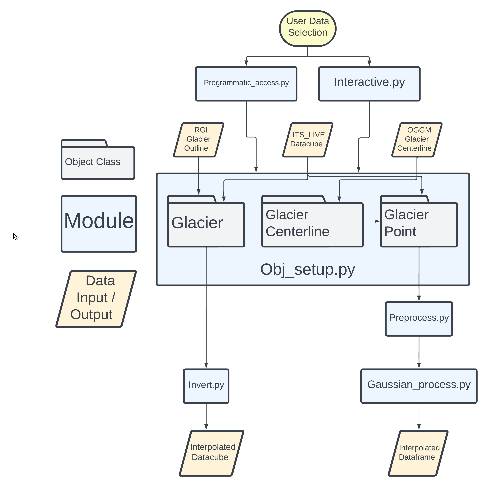

# Intro

This Jupyter Book accompanies the ITS_LIVE_TOOL package. It is intended to be a companion to the pacakge with additional explanatory text surrounding methods and scripts. 

```{note}
This book is *in progress*, we're working on it as quickly as we can!
```

# About

[](https://mybinder.org/v2/gh/vdevauxchupin/ITS_LIVE_TOOL/main?urlpath=lab/tree/)

`ITS_LIVE_TOOL` is a package designed to aid users working with the
[Inter-mission Time Series of Land Ice Velocity and Elevation](link)
(ITS_LIVE) dataset. The package provides functions for accessing data as
well as various methods to process ITS_LIVE observations. 

# Installation 

Eventually, we hope to have a pip install. For now, install via:

`pip install git+https://github.com/vdevauxchupin/ITS_LIVE_TOOL`

# Overview

The illustration below provides a high-level overview of the main object classes in `ITS_LIVE_TOOL`



 
## Data Access + Organization

We implement 3 object classes to store ITS_LIVE velocity data and auxiliary information with the goal of making it efficient and intuitive to keep track of and scale your analysis of ITS_LIVE data. 

### Interactive Widget

This is an interactive map widget designed to streamline access to ITS_LIVE image pair velocity datasets and creation of `ITS_LIVE_TOOL` objects. To see an example of the interactive widget, check out `interactive.ipynb`. Use the widget in your workflow by importing the `interactive` module.

### Programmatic Access

You can also access data by specifying a RGI ID and point coordinates. 

### `Glacier`, `Glacier_Centerline`, `Glacier_Point` objects

```{note}
once we have rendered docs, link add hyper links for these objects
```

These are meant to be container objects to store related pieces of data in easier-to-use locations. Depending on your purposes, create `Glacier`, `Glacier_Centerline` or `Glacier_Point` objects. You can do this using the interactive map widget or by manulaly passing input arguments. See `obj_setup.ipynb` for examples of each. `Glacier` objects contain RGI V7 outlines stored as `geopandas.GeoDataFrame` objects. `Glacier_Centerlines` contain OGGM centerlines, also stored as `geopandas.GeoDataFrame` objects. `Glacier_Point` objects use scripts made available by the developers of the ITS_LIVE dataset to access ITS_LIVE image pair ice velocity data. 

## Data Processing

```{note}
link to book not working, still working on best way to build book 
```

We demonstrate and make available two processing routines. Be sure to
check out the accompanying [book]() and consider if either of these are
appropriate for your data and use case. Note that these methods are in
active development and thus should be considered in *beta* phase. Please
perform your own data inspection and due diligence if implementing these
methods.

### Data filtering 

Pre-processing methods for inspecting and removing outliers from ITS_LIVE time series. Temporal baseline threshold methods focus specifically on cases where the movement of slower glaciers may be near or below the noise threshold of the imaging sensors and feature tracking algorithms. These methods aim to determine a minimum temporal baseline threshold appropriate for a given dataset. 

### Inversion

**to add** Description – link to full description and examples

## How to use

For a detailed, code-based walk through of ITS_LIVE_TOOL functionality, check out `roadmap.ipynb` notebook. This will demonstrate how to access ITS_LIVE data and use the interactive map widget and container objects provided in this package. It will also briefly describe and show sample outputs from the processing methods implemented in this package. For in-depth explanations of the processing methods, check out the individual notebooks where those steps will be described in much more detail.

## Citing 
- not sure if its appropriate/necessary here but i see some packages have a readme section for how to cite them if someone uses their work

## Contact

### Glacier objects, Data filtering
- emma.marshall@utah.edu
  
### Inversion, GUI
- vdevauxchupin@alaska.edu

## Acknowledgements
- co-authors, funding sources, other collaborators

## References

### Data
<a id="1">[1]</a> 
Velocity data generated using auto-RIFT (Gardner et al., 2018) and provided by the NASA MEaSUREs ITS_LIVE project (Gardner et al., 2023). [https://its-live.jpl.nasa.gov/](url)

<a id="2">[2]</a>
Maussion, F et. al (2019).
The Open Global Glacier Model (OGGM) v1.1.
Geoscientific Model Development.
DOI: [10.5194/gmd-12-909-2019](url)

<a id="3">[3]</a>
RGI 7.0 Consortium, 2023. Randolph Glacier Inventory - A Dataset of Global Glacier Outlines, Version 7.0. Boulder, Colorado USA. NSIDC: National Snow and Ice Data Center. doi:10.5067/f6jmovy5navz. Online access: [https://doi.org/10.5067/f6jmovy5navz](url)

### Methods 
- cite temporal inversion, other literature here?
### Software
- packages used

## Contributing
We welcome community contributions to this work! Please don't hesitate to raise an issue, start a discussion or reach out to us over email.
